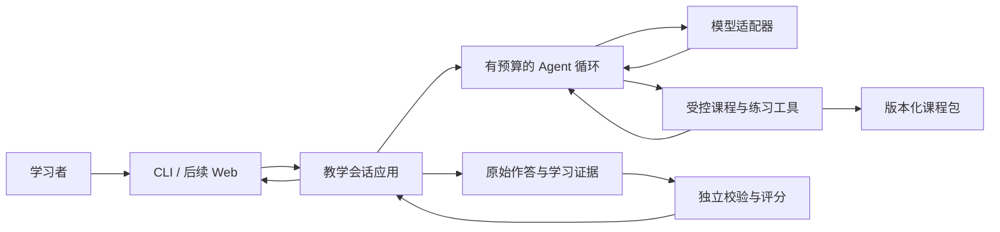

# 架构与骨架

版本：0.1。采用 Python 3.11+、模块化单体和单个教学 Agent。当前只实现 M0 的本地课程包、结构校验与 CLI；本文的运行时、教学状态、模型适配和持久化均为后续设计。

## 核心边界

领域规则定义可接受的学习证据、课程版本和完成条件。模型根据学习者表现选择解释、追问、提示、练习等动作。宿主程序负责验证动作、执行工具、保留证据、限制资源，并决定哪些状态可以写入。



这张图表示目标边界，不代表全部已经实现。CLI 用于学习开发与内部验证；面向普通用户的界面在学习闭环成立后再加入。

## 当前代码与后续增量

```text
src/education_agent/
  domain.py                 # 课程、概念、来源及其结构约束
  adapters/course_json.py   # JSON 文件读取
  cli.py                    # 课程校验/查看入口
  __main__.py
courses/bayes-intro/
  course.json               # 原创课程草稿 + 来源索引
tests/                      # 当前骨架的确定性测试
docs/                       # 产品、架构、学习路线、协作规范
```

M1 再增加 `runtime/` 的最小模型/工具循环，以及 `adapters/` 的脚本模型和一个真实模型供应商。M2 再增加 `application/` 教学会话与证据逻辑。持久化在 M3 引入。不要提前创建大量空类或让框架承包需要亲手理解的循环。

依赖方向：入口调用应用，应用依赖领域类型与模型/存储接口，外部适配器实现接口。领域模块不得导入模型 SDK、Web 框架或具体存储。当前 CLI 只组装 JSON 适配器与课程类型，课程校验可以离线执行。

## 课程包契约

`schema_version` 表示数据格式；`version` 表示该课程内容版本；二者独立。`review_status=draft` 表示尚未完成内容审核。结构合法只说明引用和格式可用，不证明教学或数学正确。

课程包含目标、先备知识、来源与概念；概念包含解释、常见误解、前置概念与来源 ID。前置关系必须无环且引用存在。来源 URL 是核查索引，校验命令不联网，也不证明 URL 当前可用或内容已被专家认可。

练习与评分标准在后续单独建立，避免所有答案随课程包一起进入导师上下文。每条作答都应绑定课程版本、题目版本和 rubric 版本。

独立测验由宿主直接呈现题目，在锁定用户原始首答前不经过导师解释或计算输出。若请求帮助，宿主先把该题标记为辅助练习，再恢复导师。仅隐藏答案库不足以保证独立性，因为模型也可能自行解题。独立检查的“锁定首答 → 评分 → 反馈”属于应用层协议。

## 教学状态与证据

后续 `LearningSession` 保存课程版本、当前目标、允许的教学阶段与运行状态。教学阶段可在诊断、解释、练习、迁移、回顾间切换；会话生命周期另用 active/paused/completed/failed 表达。

后续 `Attempt` 至少保存题目、用户原始回答、时间、提示等级、是否已见答案及首答/重答关系。原始作答由宿主从用户消息记录，模型不能替用户伪造答题证据。

后续 `Assessment` 保存分项、引用的作答证据、评分者和版本；`LearningEvidence` 区分独立、辅助与尚未观察到的能力。模型提议结束后，应用层按课程规则检查证据是否足够，不直接接受“用户已经掌握”的文字结论。

## 首批工具与执行边界

| 候选工具 | 作用 | 限制 |
| --- | --- | --- |
| `get_concept` | 按 ID 读取审核课程中的解释和出处 | 仅当前课程；不任意浏览文件 |
| `get_practice` | 获取当前阶段允许的练习 | 不返回保留题答案；记录曝光 |
| `calculate_bayes` | 验证参数后确定性计算 | 参数在 0–1，分母为零明确报错；不替用户猜参数 |
| `check_practice` | 按标准核查练习作答 | 仅在已有真实作答后使用；提示和答案揭示受阶段约束 |

工具并不强制全部在 M1 实现。先做一个只读工具，再逐个增加。记录作答、修改评分和宣布完成由宿主接口控制，不能简单提供任意写状态的模型工具。

循环从第一版就有最大步数、超时与明确停止原因；模型返回工具调用后，宿主检查名称和参数，执行结果必须与调用 ID 配对。达到上限保留未完成状态，不能伪装为学习完成。外部模型或工具错误返回可诊断信息；重试只用于适合重试的操作。

## 已选与延后决策

| 选择 | 原因与重新评估时机 |
| --- | --- |
| Python、标准库 M0 | 用户熟悉 Python；先减少安装负担，当前无运行时第三方依赖 |
| 单 Agent、模块化单体 | 足以实现一节自适应课；发现清晰并行瓶颈后再讨论多 Agent |
| 小型版本化课程包 | 首课规模小，按 ID 检索即可；资料规模增长后再评估全文检索或向量库 |
| 模型适配边界 | 教学领域不绑定供应商；真实供应商、模型和预算在 M1 接入时确定 |
| 本地开发先行 | 先证明学习闭环；用户界面、身份与多用户隔离在实际试点前补齐 |
| 暂无长期自动记忆 | 首先存可追溯作答；有跨课需求后再设计召回和失效 |

模型收到的教材和用户领域材料是内容，不是新的操作授权。开发过程的 Lead/Develop 协作另见 [协作规范](collaboration.md)，不能与产品内部的教学角色混为一谈。
